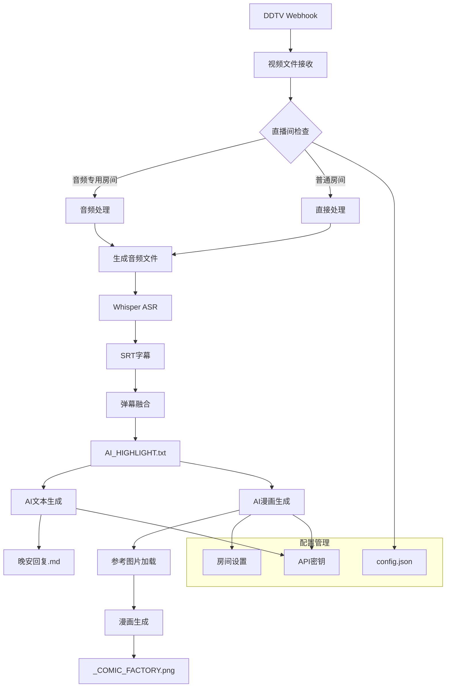

# AI总结增强功能实施计划

## 概述
本计划旨在为danmaku-to-summary-ts项目添加三个核心功能：
1. **音频处理功能**：将指定直播间的视频转为音频以节省空间
2. **AI文本生成功能**：使用Gemini API生成"饼干岁"风格的晚安回复
3. **AI漫画生成功能**：使用Hugging Face AI Comic Factory生成直播总结漫画

## 当前项目分析

### 现有流程
```
DDTV Webhook → 视频文件 → Whisper ASR → SRT字幕 → 弹幕融合 → AI_HIGHLIGHT.txt
```

### 目标流程
```
DDTV Webhook → 视频文件 → [音频处理] → Whisper ASR → SRT字幕 → 弹幕融合 → AI_HIGHLIGHT.txt
                                                              ↓
                                                      [AI文本生成] → 晚安回复.md
                                                              ↓
                                                      [AI漫画生成] → _COMIC_FACTORY.png
```

### 系统架构图


## 功能详细设计

### 1. 音频处理功能

#### 配置扩展
```json
{
  "audioProcessing": {
    "enabled": true,
    "audioOnlyRooms": [26966466],
    "audioFormat": ".m4a",
    "bitrate": "128k",
    "deleteOriginalVideo": false,
    "referenceImages": {
      "26966466": "D:/files/Pictures/保存素材/小猫帽/岁己参考图.jpg"
    }
  }
}
```

#### 实现要点
- 在`webhook_server.js`中添加音频处理逻辑
- 使用`ffmpeg`命令行工具转换视频为音频
- 支持配置多个直播间ID
- 文件稳定后进行处理，避免中断录制

#### 技术细节
```javascript
// ffmpeg命令示例
ffmpeg -i input.mp4 -vn -c:a aac -b:a 128k output.m4a
```

### 2. AI文本生成功能

#### 配置扩展
```json
{
  "aiServices": {
    "gemini": {
      "enabled": true,
      "apiKey": "YOUR_GEMINI_API_KEY",
      "model": "gemini-1.5-flash",
      "temperature": 0.7
    }
  }
}
```

#### 实现要点
- 创建新的脚本`src/scripts/ai_text_generator.js`
- 集成Google Gemini API
- 使用提供的prompt模板生成"饼干岁"风格回复
- 输出文件命名：`{baseName}_晚安回复.md`

#### 提示词模板
```text
【角色设定】
身份：岁己SUI的铁粉（自称"饼干岁"或"饼干"）。
性格：喜欢调侃、宠溺主播，有点话痨...
【核心原则】
严格限定素材：只根据用户当前提供的文档/文本内容进行创作...
```

### 3. AI漫画生成功能

#### 配置扩展
```json
{
  "aiServices": {
    "huggingFace": {
      "enabled": true,
      "comicFactory": {
        "model": "jbilcke-hf/ai-comic-factory",
        "apiToken": "YOUR_HF_TOKEN"
      }
    }
  }
}
```

#### 实现要点
- 创建新的脚本`src/scripts/ai_comic_generator.js`
- 使用`gradio_client`库调用Hugging Face Spaces
- 支持参考图片保持角色一致性
- 输出文件命名：`{baseName}_COMIC_FACTORY.png`

#### 提示词结构
```text
<job>你作为虚拟主播二创画师大手子，根据直播内容，绘制直播总结插画。</job>
<character>注意一定要还原附件image_0图片中的角色形象...</character>
<style>多个剪贴画风格或者少年漫多个分镜（5~8个吧）...</style>
```

## 文件结构变更

### 新增文件
```
src/scripts/
├── ai_text_generator.js      # AI文本生成主脚本
├── ai_comic_generator.js     # AI漫画生成主脚本
├── audio_processor.js        # 音频处理工具
└── enhanced_auto_summary.js  # 增强版自动化脚本
```

### 修改文件
```
src/scripts/
├── config.json              # 扩展配置
├── webhook_server.js        # 添加音频处理逻辑
└── auto_summary.js          # 集成AI生成功能
```

## 实施步骤

### 阶段1：配置系统扩展
1. 扩展`config.json`配置文件
2. 创建配置文件模板和文档
3. 添加环境变量支持

### 阶段2：音频处理功能
1. 实现`audio_processor.js`工具模块
2. 在`webhook_server.js`中集成音频处理
3. 添加ffmpeg依赖检查和错误处理
4. 测试音频转换功能

### 阶段3：AI文本生成
1. 实现`ai_text_generator.js`模块
2. 集成Gemini API客户端
3. 实现提示词模板系统
4. 添加Markdown格式化输出

### 阶段4：AI漫画生成
1. 实现`ai_comic_generator.js`模块
2. 集成Hugging Face Gradio客户端
3. 实现参考图片上传机制
4. 添加图片下载和保存逻辑

### 阶段5：流程集成
1. 创建`enhanced_auto_summary.js`整合所有功能
2. 更新现有脚本调用新功能
3. 添加错误处理和重试机制
4. 完善日志记录

### 阶段6：测试和优化
1. 单元测试各个模块
2. 集成测试完整流程
3. 性能优化和错误处理
4. 文档编写

## 技术依赖

### 新增依赖
```json
{
  "dependencies": {
    "@google/generative-ai": "^0.21.0",
    "gradio-client": "^0.15.0",
    "axios": "^1.6.0"
  }
}
```

### 系统依赖
- ffmpeg（音频处理）
- Python环境（可选，用于gradio-client）

## 配置管理

### 配置文件结构
```javascript
// config.json 扩展示例
{
  "audioProcessing": { /* 音频配置 */ },
  "aiServices": { /* AI服务配置 */ },
  "roomSettings": {
    "26966466": {
      "audioOnly": true,
      "referenceImage": "path/to/image.jpg",
      "enableComic": true
    }
  }
}
```

### 环境变量支持
- `GEMINI_API_KEY`: Gemini API密钥
- `HF_TOKEN`: Hugging Face令牌
- `FFMPEG_PATH`: ffmpeg可执行文件路径

## 错误处理策略

### 分级错误处理
1. **轻微错误**：记录日志，继续流程
2. **可恢复错误**：重试机制（最多3次）
3. **严重错误**：停止流程，发送通知

### 监控和日志
- 详细的处理日志
- 性能指标记录
- 错误统计和报告

## 安全考虑

### API密钥安全
- 使用配置文件或环境变量
- 避免在代码中硬编码密钥
- 提供配置模板而不包含真实密钥

### 文件权限
- 确保输出文件权限正确
- 避免覆盖重要文件
- 添加文件存在性检查

## 后续扩展可能性

### 功能扩展
1. 支持更多AI模型（Claude、GPT等）
2. 添加视频摘要生成
3. 实现批量处理模式
4. 添加Web界面管理

### 性能优化
1. 并行处理多个任务
2. 缓存机制减少API调用
3. 增量处理避免重复工作

## 风险评估

### 技术风险
1. **API服务稳定性**：依赖第三方API服务
2. **ffmpeg兼容性**：不同系统环境差异
3. **内存使用**：大文件处理可能内存占用高

### 缓解措施
1. 添加备用API服务支持
2. 提供详细的安装文档
3. 实现流式处理和分块处理

## 成功标准

### 功能完成
- [ ] 音频处理功能正常工作
- [ ] AI文本生成符合"饼干岁"风格
- [ ] AI漫画生成包含参考图片特征
- [ ] 完整流程自动化运行

### 性能指标
- 处理时间在可接受范围内
- 内存使用稳定
- 错误率低于5%

### 用户体验
- 配置简单明了
- 日志清晰可读
- 错误信息有帮助性

---

*本计划将作为实施指南，可根据实际情况进行调整。*