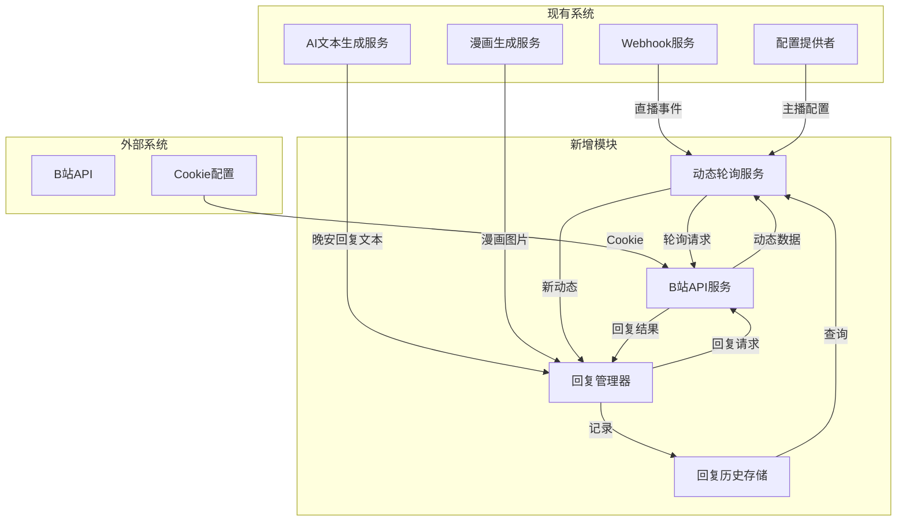

# B站动态回复功能实现计划

## 1. 功能概述

实现一个能够自动检测B站主播动态并自动回复的系统，支持多主播轮询、防重复回复、频次控制等功能。

## 2. 核心需求

### 2.1 基本功能
- 支持多个主播的动态检测
- 自动回复主播的动态（文本+图片）
- 记录已回复的动态ID，防止重复回复
- 只回复直播开始后发布的动态

### 2.2 轮询策略
- 所有主播加起来每1分钟检测一次
- 采用轮询方式：A → B → C → A → ...
- 控制整体请求频次，避免被B站检测

### 2.3 时间判断
- 优先使用webhook事件中的直播开始时间
- 备用方案：从录播文件名中提取时间戳

## 3. 系统架构设计

### 3.1 整体架构图



### 3.2 模块职责

#### 3.2.1 BilibiliAPIService（B站API服务）
- 职责：封装B站API调用
- 功能：
  - 获取主播动态列表
  - 发布动态评论
  - 上传图片
  - Cookie管理和刷新

#### 3.2.2 DynamicPollingService（动态轮询服务）
- 职责：管理主播动态的轮询检测
- 功能：
  - 维护主播列表和轮询队列
  - 定时检测主播动态
  - 过滤符合条件的动态（直播开始后、未回复）
  - 触发回复任务

#### 3.2.3 ReplyManager（回复管理器）
- 职责：管理动态回复的执行
- 功能：
  - 获取晚安回复文本和图片
  - 执行回复操作
  - 记录回复历史
  - 处理回复失败重试

#### 3.2.4 ReplyHistoryStore（回复历史存储）
- 职责：存储和管理回复历史
- 功能：
  - 记录已回复的动态ID
  - 查询动态是否已回复
  - 清理过期记录

## 4. 数据结构设计

### 4.1 主播配置结构

```typescript
interface AnchorConfig {
  // 主播UID
  uid: string;
  // 主播名称
  name: string;
  // 房间ID（用于关联录播）
  roomId?: string;
  // 是否启用动态回复
  enabled: boolean;
  // 直播开始时间（从webhook获取）
  liveStartTime?: Date;
  // 最后检测时间
  lastCheckTime?: Date;
}
```

### 4.2 动态数据结构

```typescript
interface BilibiliDynamic {
  // 动态ID
  id: string;
  // 主播UID
  uid: string;
  // 动态类型
  type: 'DYNAMIC_TYPE_AV' | 'DYNAMIC_TYPE_WORD' | 'DYNAMIC_TYPE_DRAW';
  // 动态内容
  content: string;
  // 图片列表
  images?: string[];
  // 发布时间
  publishTime: Date;
  // 动态URL
  url: string;
}
```

### 4.3 回复历史结构

```typescript
interface ReplyHistory {
  // 动态ID
  dynamicId: string;
  // 主播UID
  uid: string;
  // 回复时间
  replyTime: Date;
  // 回复内容摘要
  contentSummary: string;
  // 是否成功
  success: boolean;
  // 错误信息
  error?: string;
}
```

### 4.4 回复任务结构

```typescript
interface ReplyTask {
  // 任务ID
  taskId: string;
  // 动态数据
  dynamic: BilibiliDynamic;
  // 晚安回复文本路径
  textPath: string;
  // 漫画图片路径
  imagePath: string;
  // 重试次数
  retryCount: number;
  // 创建时间
  createTime: Date;
}
```

## 5. 配置文件设计

### 5.1 config/default.json 新增配置

```json
{
  "bilibili": {
    "enabled": true,
    "polling": {
      "interval": 60000,
      "maxRetries": 3,
      "retryDelay": 5000
    },
    "anchors": {
      "25788785": {
        "name": "岁己SUI",
        "roomId": "25788785",
        "enabled": true
      }
    }
  }
}
```

### 5.2 config.secrets.json 新增配置

```json
{
  "bilibili": {
    "cookie": "YOUR_BILIBILI_COOKIE_HERE",
    "csrf": "YOUR_BILIBILI_CSRF_HERE"
  }
}
```

## 6. 实现步骤

### 6.1 第一阶段：B站API服务
- [ ] 创建 `src/services/bilibili/BilibiliAPIService.ts`
- [ ] 实现获取动态列表API
- [ ] 实现发布评论API
- [ ] 实现图片上传API
- [ ] 实现Cookie管理

### 6.2 第二阶段：回复历史存储
- [ ] 创建 `src/services/bilibili/ReplyHistoryStore.ts`
- [ ] 实现基于文件的存储
- [ ] 实现查询和记录功能
- [ ] 实现过期清理功能

### 6.3 第三阶段：动态轮询服务
- [ ] 创建 `src/services/bilibili/DynamicPollingService.ts`
- [ ] 实现轮询队列管理
- [ ] 实现动态检测逻辑
- [ ] 实现时间过滤逻辑
- [ ] 实现与webhook的集成

### 6.4 第四阶段：回复管理器
- [ ] 创建 `src/services/bilibili/ReplyManager.ts`
- [ ] 实现回复任务队列
- [ ] 实现文本和图片获取
- [ ] 实现回复执行逻辑
- [ ] 实现重试机制

### 6.5 第五阶段：配置和集成
- [ ] 更新配置接口定义
- [ ] 更新配置加载器
- [ ] 集成到ServiceManager
- [ ] 添加启动/停止控制

### 6.6 第六阶段：测试和优化
- [ ] 单元测试
- [ ] 集成测试
- [ ] 性能优化
- [ ] 错误处理完善

## 7. 关键技术点

### 7.1 B站API调用
- 使用Cookie进行身份验证
- 需要处理CSRF Token
- 需要处理请求频率限制

### 7.2 图片上传
- B站图片上传需要分步操作
- 先上传获取图片URL
- 再在评论中使用图片URL

### 7.3 防重复回复
- 使用动态ID作为唯一标识
- 持久化存储已回复的动态ID
- 查询时先检查是否已回复

### 7.4 频次控制
- 使用轮询方式分散请求
- 添加随机延迟避免规律性
- 监控请求频率，超限自动暂停

### 7.5 时间判断
- 从webhook事件中获取直播开始时间
- 从录播文件名中提取时间戳作为备用
- 比较动态发布时间和直播开始时间

## 8. 文件结构

```
src/services/bilibili/
├── index.ts                          # 导出接口
├── BilibiliAPIService.ts            # B站API服务
├── DynamicPollingService.ts          # 动态轮询服务
├── ReplyManager.ts                  # 回复管理器
├── ReplyHistoryStore.ts              # 回复历史存储
├── interfaces/
│   ├── IBilibiliAPIService.ts        # B站API服务接口
│   ├── IDynamicPollingService.ts    # 动态轮询服务接口
│   ├── IReplyManager.ts             # 回复管理器接口
│   └── types.ts                     # 类型定义
└── utils/
    ├── cookieParser.ts              # Cookie解析工具
    └── timeUtils.ts                 # 时间处理工具

data/
└── reply_history.json               # 回复历史存储文件
```

## 9. 风险和注意事项

### 9.1 B站API限制
- B站可能对API调用进行限制
- 需要处理429错误（请求过多）
- Cookie可能过期，需要定期刷新

### 9.2 频次控制
- 过于频繁的请求可能导致账号被封
- 需要合理设置轮询间隔
- 添加随机延迟避免规律性

### 9.3 数据一致性
- 回复历史需要持久化存储
- 需要处理并发访问问题
- 需要定期清理过期数据

### 9.4 错误处理
- 网络错误需要重试
- API错误需要记录和告警
- 需要优雅降级机制

## 10. 后续扩展

### 10.1 功能扩展
- 支持更多动态类型
- 支持自定义回复模板
- 支持多账号轮换

### 10.2 监控和统计
- 添加回复成功率统计
- 添加API调用统计
- 添加异常告警

### 10.3 性能优化
- 使用缓存减少API调用
- 优化轮询策略
- 支持分布式部署
