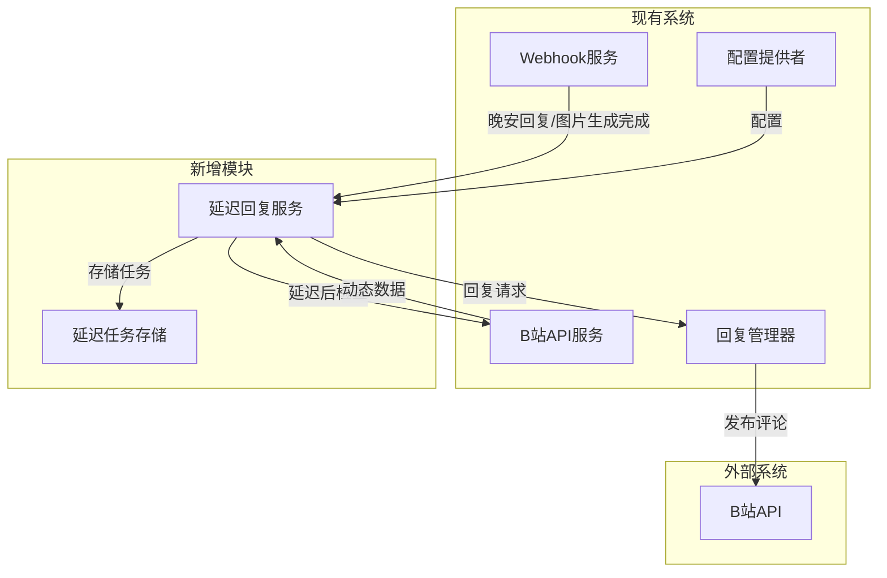

# 修复配置验证和实现延迟动态回复功能计划

## 任务概述

1. **修复配置验证问题**：pm2启动失败，因为 `production.json` 缺少 `bilibili` 配置节
2. **实现延迟动态回复功能**：hook触发晚安回复生成/图片生成后，10分钟后检查对应主播动态，在最新一条动态里面回复【晚安回复+总结图片】

---

## 第一部分：修复配置验证问题

### 问题分析

错误信息显示：
```
Configuration validation failed:
  bilibili.enabled: Bilibili enabled is required
  bilibili.polling: Bilibili polling configuration is required
  bilibili.anchors: Bilibili anchors configuration is required
```

`ConfigValidator.ts` 要求必须有 `bilibili.enabled`、`bilibili.polling` 和 `bilibili.anchors`，但 `production.json` 缺少这些配置。

### 解决方案

在 `config/production.json` 中添加 `bilibili` 配置节：

```json
{
  "bilibili": {
    "enabled": false,
    "polling": {
      "interval": 60000,
      "maxRetries": 3,
      "retryDelay": 5000
    },
    "anchors": {}
  }
}
```

**注意**：默认设置为 `enabled: false`，避免在未配置时自动启动轮询服务。

---

## 第二部分：实现延迟动态回复功能

### 功能需求

1. hook触发晚安回复生成/图片生成后
2. 10分钟后检查对应主播动态
3. 在最新一条动态里面回复【晚安回复+总结图片】
4. 可配置：全局关、单个主播可以设置开

### 系统架构设计



### 数据结构设计

#### 延迟回复任务

```typescript
interface DelayedReplyTask {
  taskId: string;
  roomId: string;
  uid?: string;
  goodnightTextPath: string;
  comicImagePath?: string;
  createTime: Date;
  scheduledTime: Date;
  status: 'pending' | 'processing' | 'completed' | 'failed';
  retryCount: number;
  error?: string;
}
```

### 配置设计

#### config/default.json 新增配置

```json
{
  "bilibili": {
    "enabled": false,
    "polling": {
      "interval": 60000,
      "maxRetries": 3,
      "retryDelay": 5000
    },
    "anchors": {},
    "delayedReply": {
      "enabled": false,
      "delayMinutes": 10,
      "maxRetries": 3,
      "retryDelayMinutes": 5
    }
  }
}
```

#### config/production.json 新增配置

```json
{
  "bilibili": {
    "enabled": false,
    "polling": {
      "interval": 60000,
      "maxRetries": 3,
      "retryDelay": 5000
    },
    "anchors": {
      "25788785": {
        "uid": "25788785",
        "name": "岁己SUI",
        "roomId": "25788785",
        "enabled": true,
        "delayedReplyEnabled": true
      }
    },
    "delayedReply": {
      "enabled": false,
      "delayMinutes": 10,
      "maxRetries": 3,
      "retryDelayMinutes": 5
    }
  }
}
```

### 模块设计

#### 1. DelayedReplyService（延迟回复服务）

**职责**：
- 管理延迟回复任务
- 定时检查任务是否到期
- 执行延迟回复逻辑
- 处理失败重试

**接口**：

```typescript
interface IDelayedReplyService {
  start(): Promise<void>;
  stop(): Promise<void>;
  addTask(task: DelayedReplyTask): Promise<void>;
  removeTask(taskId: string): Promise<void>;
  getTasks(): DelayedReplyTask[];
  isRunning(): boolean;
}
```

**核心方法**：

```typescript
class DelayedReplyService implements IDelayedReplyService {
  // 添加延迟回复任务
  async addTask(roomId: string, goodnightTextPath: string, comicImagePath?: string): Promise<string>;

  // 处理到期的任务
  private async processDueTasks(): Promise<void>;

  // 执行延迟回复
  private async executeDelayedReply(task: DelayedReplyTask): Promise<void>;

  // 获取主播UID
  private async getAnchorUid(roomId: string): Promise<string | null>;

  // 获取最新动态
  private async getLatestDynamic(uid: string): Promise<BilibiliDynamic | null>;
}
```

#### 2. DelayedReplyStore（延迟任务存储）

**职责**：
- 持久化存储延迟任务
- 提供任务查询和更新接口

**接口**：

```typescript
interface IDelayedReplyStore {
  initialize(): Promise<void>;
  addTask(task: DelayedReplyTask): Promise<void>;
  getTask(taskId: string): Promise<DelayedReplyTask | null>;
  getPendingTasks(): Promise<DelayedReplyTask[]>;
  updateTask(taskId: string, updates: Partial<DelayedReplyTask>): Promise<void>;
  removeTask(taskId: string): Promise<void>;
  cleanupOldTasks(): Promise<void>;
}
```

### 实现步骤

#### 步骤1：修复配置验证问题

1. 在 `config/production.json` 中添加 `bilibili` 配置节
2. 验证配置加载是否正常

#### 步骤2：更新配置接口定义

1. 在 `src/core/config/ConfigInterface.ts` 中添加 `DelayedReplyConfig` 接口
2. 更新 `BilibiliConfig` 接口，添加 `delayedReply` 字段
3. 更新 `AnchorConfig` 接口，添加 `delayedReplyEnabled` 字段

#### 步骤3：创建延迟任务存储

1. 创建 `src/services/bilibili/DelayedReplyStore.ts`
2. 实现基于文件的持久化存储
3. 实现任务查询和更新功能

#### 步骤4：创建延迟回复服务

1. 创建 `src/services/bilibili/DelayedReplyService.ts`
2. 实现任务管理逻辑
3. 实现定时检查和执行逻辑
4. 实现与 BilibiliAPIService 和 ReplyManager 的集成

#### 步骤5：更新 WebhookService

1. 在 `src/services/webhook/WebhookService.ts` 中集成 `DelayedReplyService`
2. 在晚安回复/图片生成完成后触发延迟任务
3. 添加配置检查逻辑

#### 步骤6：更新 ServiceManager

1. 在 `src/services/ServiceManager.ts` 中初始化 `DelayedReplyService`
2. 实现服务的启动和停止逻辑

#### 步骤7：更新配置文件

1. 更新 `config/default.json`，添加 `bilibili.delayedReply` 配置
2. 更新 `config/production.json`，添加 `bilibili.delayedReply` 配置和主播配置

#### 步骤8：测试

1. 测试配置验证修复
2. 测试延迟回复功能
3. 测试全局开关和单个主播开关

### 文件结构

```
src/services/bilibili/
├── index.ts
├── BilibiliAPIService.ts
├── DynamicPollingService.ts
├── ReplyManager.ts
├── ReplyHistoryStore.ts
├── DelayedReplyService.ts          # 新增
├── DelayedReplyStore.ts            # 新增
└── interfaces/
    ├── IBilibiliAPIService.ts
    ├── IDynamicPollingService.ts
    ├── IReplyManager.ts
    ├── IReplyHistoryStore.ts
    ├── IDelayedReplyService.ts     # 新增
    ├── IDelayedReplyStore.ts       # 新增
    └── types.ts

data/
└── delayed_reply_tasks.json        # 新增 - 延迟任务存储文件
```

### 关键技术点

#### 1. 延迟任务调度

使用 `setTimeout` 实现延迟执行，但需要持久化任务以防止服务重启丢失。

#### 2. 任务恢复

服务启动时从存储中加载未完成的任务，重新设置定时器。

#### 3. 配置检查

- 全局开关：`bilibili.delayedReply.enabled`
- 单个主播开关：`bilibili.anchors[uid].delayedReplyEnabled`

#### 4. 错误处理

- 网络错误重试
- API错误记录
- 任务状态更新

### 风险和注意事项

1. **服务重启**：需要确保延迟任务在服务重启后能够恢复
2. **并发控制**：避免同时处理多个任务导致API限流
3. **配置变更**：配置变更后需要能够动态更新任务
4. **存储一致性**：确保任务状态的持久化和一致性

### 后续扩展

1. 支持自定义延迟时间
2. 支持多种回复模板
3. 支持任务优先级
4. 添加任务统计和监控
