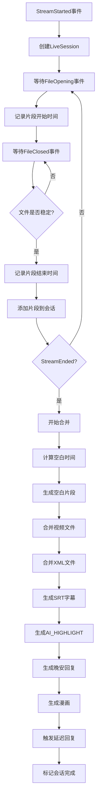

# 直播片段合并方案

## 问题分析

### 当前问题
1. DDTV将同一场直播分割成多个录播文件
2. 每个文件处理完成后都会触发延迟回复任务
3. 导致同一个房间有多个待处理任务
4. 没有合并机制，无法将同一场直播的多个片段整合

### 文件命名规则
```
录制-{房间ID}-{日期}-{时间}-{序号}-{标题}.flv
```

示例：
```
录制-1741667419-20260119-220437-226-聊半小时..flv
录制-1741667419-20260119-220531-698-聊半小时..flv
录制-1741667419-20260119-220638-079-聊半小时..flv
录制-1741667419-20260119-220716-641-聊半小时..flv
```

同一场直播的片段特征：
- 相同的房间ID
- 相同的日期
- 相同的标题

## 解决方案设计

### 1. 片段收集机制

#### 1.1 会话管理
利用MikufansWebhookHandler的SessionId来识别同一场直播：

```typescript
interface LiveSession {
  sessionId: string;
  roomId: string;
  roomName: string;
  title: string;
  startTime: Date;
  endTime?: Date;
  segments: LiveSegment[];  // 片段列表
  status: 'collecting' | 'merging' | 'processing' | 'completed';
}

interface LiveSegment {
  videoPath: string;
  xmlPath: string;
  fileOpenTime: Date;
  fileCloseTime: Date;
  eventTimestamp: Date;
}
```

#### 1.2 收集策略
- **StreamStarted事件**：创建新的会话
- **FileOpening事件**：记录片段开始时间（FileOpenTime）
- **FileClosed事件**：记录片段结束时间（FileCloseTime），将文件添加到对应会话
- **StreamEnded事件**：触发合并流程

### 2. 文件合并机制

#### 2.1 音视频合并
使用ffmpeg拼接视频文件，处理片段之间的空白：

```bash
# 创建文件列表
file 'segment1.flv'
file 'segment2.flv'
file 'segment3.flv'

# 合并视频
ffmpeg -f concat -safe 0 -i filelist.txt -c copy merged.flv
```

**处理空白片段**：
- 根据FileOpenTime和FileCloseTime计算片段之间的空白时间
- 使用ffmpeg创建空白视频片段填充空白
- 确保合并后的视频时间轴与XML弹幕时间戳对齐

#### 2.2 XML弹幕合并
合并XML弹幕文件，需要调整时间戳：

```typescript
function mergeXmlFiles(segments: LiveSegment[], outputXmlPath: string): void {
  let currentTimeOffset = 0;  // 当前时间偏移量
  
  for (const segment of segments) {
    // 1. 解析XML文件
    const danmakus = parseXml(segment.xmlPath);
    
    // 2. 调整弹幕时间戳
    const adjustedDanmakus = danmakus.map(d => ({
      ...d,
      time: d.time + currentTimeOffset
    }));
    
    // 3. 添加到合并列表
    mergedDanmakus.push(...adjustedDanmakus);
    
    // 4. 更新时间偏移量（加上当前片段时长）
    currentTimeOffset += getSegmentDuration(segment);
  }
  
  // 5. 生成合并后的XML文件
  generateXml(mergedDanmakus, outputXmlPath);
}
```

#### 2.3 合并文件命名规则
合并后的文件使用类似命名规则：
```
录制-{房间ID}-{日期}-{开始时间}-MERGED-{标题}.flv
录制-{房间ID}-{日期}-{开始时间}-MERGED-{标题}.xml
```

示例：
```
录制-1741667419-20260119-220437-MERGED-聊半小时.flv
录制-1741667419-20260119-220437-MERGED-聊半小时.xml
```

#### 2.4 文件组织结构
合并后的文件组织：
```
{日期目录}/
  ├── bak/                          # 原始片段备份文件夹
  │   ├── 录制-1741667419-20260119-220437-226-聊半小时..flv
  │   ├── 录制-1741667419-20260119-220531-698-聊半小时..flv
  │   ├── 录制-1741667419-20260119-220638-079-聊半小时..flv
  │   ├── 录制-1741667419-20260119-220716-641-聊半小时..flv
  │   ├── 录制-1741667419-20260119-220437-226-聊半小时..xml
  │   ├── 录制-1741667419-20260119-220531-698-聊半小时..xml
  │   ├── 录制-1741667419-20260119-220638-079-聊半小时..xml
  │   └── 录制-1741667419-20260119-220716-641-聊半小时..xml
  ├── 录制-1741667419-20260119-220437-MERGED-聊半小时.flv  # 合并后的视频
  ├── 录制-1741667419-20260119-220437-MERGED-聊半小时.xml  # 合并后的XML
  └── 录制-1741667419-20260119-220437-226-聊半小时.jpg        # 封面图（从第一个片段复制）
```

**单片段场景**：
如果直播只有一个片段，不需要合并，直接使用原始文件进行处理。

### 3. 处理流程

#### 3.1 流程图



#### 3.2 状态转换

```
collecting -> merging -> processing -> completed
```

#### 3.3 空白片段处理

根据FileOpenTime和FileCloseTime计算片段之间的空白时间：

```typescript
function calculateGapTime(prevSegment: LiveSegment, nextSegment: LiveSegment): number {
  // 前一个片段的结束时间
  const prevEndTime = prevSegment.fileCloseTime.getTime();
  
  // 后一个片段的开始时间
  const nextStartTime = nextSegment.fileOpenTime.getTime();
  
  // 空白时间（毫秒）
  return nextStartTime - prevEndTime;
}
```

如果空白时间 > 0，则创建空白视频片段填充：
```bash
# 创建空白视频（黑屏，静音）
ffmpeg -f lavfi -i color=c=black:s=1920x1080:d=5 -f lavfi -i anullsrc=r=44100:cl=mono -c:v libx264 -c:a aac -t 5 blank_5s.mp4
```

### 4. 实现细节

#### 4.1 新增类：LiveSessionManager

```typescript
class LiveSessionManager {
  private sessions: Map<string, LiveSession> = new Map();
  private mergeTimeouts: Map<string, NodeJS.Timeout> = new Map();

  // 创建会话
  createSession(sessionId: string, roomId: string, roomName: string): void;

  // 添加文件
  addFile(sessionId: string, filePath: string): void;

  // 触发合并
  triggerMerge(sessionId: string): Promise<void>;

  // 清理过期会话
  cleanupExpiredSessions(): void;
}
```

#### 4.2 新增类：FileMerger

```typescript
class FileMerger {
  // 合并视频文件
  async mergeVideos(videoFiles: string[], outputPath: string): Promise<void>;

  // 合并XML文件
  async mergeXmlFiles(xmlFiles: string[], outputPath: string): Promise<void>;

  // 获取视频时长
  async getVideoDuration(videoPath: string): Promise<number>;
}
```

### 5. 配置项

```json
{
  "webhook": {
    "endpoints": {
      "mikufans": {
        "merge": {
          "enabled": true,
          "maxSegments": 20,            // 最大片段数限制
          "fillGaps": true,             // 是否填充空白片段
          "backupOriginals": true,        // 是否备份原始片段到bak文件夹
          "copyCover": true              // 是否复制封面图
        }
      }
    }
  }
}
```

### 6. 实现步骤

1. **创建LiveSessionManager类**
   - 管理直播会话
   - 收集片段文件（记录FileOpenTime和FileCloseTime）
   - 处理StreamEnded事件触发合并

2. **创建FileMerger类**
   - 实现视频合并（使用ffmpeg）
   - 实现空白片段生成
   - 实现XML合并（调整时间戳）
   - 计算片段之间的空白时间

3. **修改MikufansWebhookHandler**
   - 集成LiveSessionManager
   - 处理StreamStarted事件
   - 处理FileOpening事件（记录开始时间）
   - 处理FileClosed事件（记录结束时间）
   - 处理StreamEnded事件（触发合并）

4. **修改处理流程**
   - 使用合并后的文件
   - 生成统一的AI_HIGHLIGHT
   - 触发单个延迟回复任务

5. **测试验证**
   - 测试单片段场景
   - 测试多片段场景
   - 测试空白片段场景
   - 测试StreamEnded事件
   - 测试异常场景

### 7. 优势

1. **统一处理**：同一场直播只生成一个晚安回复
2. **数据完整**：合并后的文件包含完整的直播内容
3. **管理方便**：减少文件数量，便于管理
4. **CD机制**：配合30分钟CD，防止重复发送

### 8. 注意事项

1. **时间戳调整**：合并XML时需要调整后续片段的时间戳，确保与视频时间轴对齐
2. **空白片段处理**：根据FileOpenTime和FileCloseTime计算空白时间，生成空白视频片段填充
3. **文件备份**：合并后将原始片段移动到bak文件夹（通过配置控制）
4. **封面图处理**：从第一个片段复制封面图到主目录
5. **单片段场景**：如果直播只有一个片段，不需要合并，直接使用原始文件
6. **错误处理**：合并失败时需要回滚或重试
7. **性能考虑**：大文件合并可能需要较长时间
8. **存储空间**：合并过程中需要额外的存储空间
9. **StreamEnded事件**：依赖Mikufans发送StreamEnded事件来触发合并
10. **文件命名**：合并后的文件使用MERGED标识，便于区分原始片段和合并文件
