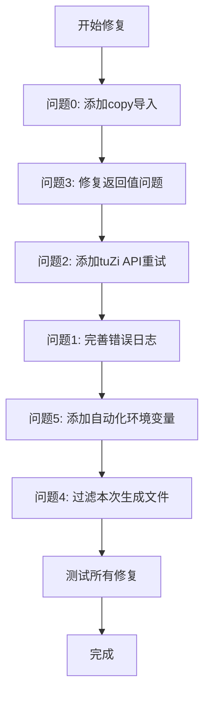

# 日志问题修复计划

## 问题分析

根据日志分析，发现以下6个问题需要修复：

---

## 问题0：ai_comic_generator.py缺少copy模块导入（P0）

### 问题描述
```
NameError: name 'copy' is not defined. Did you forget to import 'copy'
```
在 [`src/scripts/ai_comic_generator.py`](src/scripts/ai_comic_generator.py) 第50行，使用了 `copy.deepcopy()` 但是没有导入 `copy` 模块。

### 根本原因
配置加载代码中使用了 `copy.deepcopy(default_config)`，但文件开头的 import 语句中没有导入 `copy` 模块。

### 修复方案
在文件开头的 import 部分添加 `import copy`。

### 文件位置
- `src/scripts/ai_comic_generator.py` 第8行之后

---

## 问题1：MikufansWebhookHandler错误日志不完整

### 问题描述
```
[ERROR] MikufansWebhookHandler: [Mikufans处理进程错误] Traceback (most recent call last):
```
错误信息被截断，没有打印完整的堆栈跟踪，无法定位问题根因。

### 根本原因
在 [`src/services/webhook/handlers/MikufansWebhookHandler.ts`](src/services/webhook/handlers/MikufansWebhookHandler.ts) 第272行，stderr的处理可能存在问题。

### 修复方案
1. 确保 stderr 数据完整捕获并输出
2. 改进错误日志格式，显示完整错误信息

### 文件位置
- `src/services/webhook/handlers/MikufansWebhookHandler.ts` 第271-273行

---

## 问题2：漫画生成超频时应使用tuZi API重试

### 问题描述
```
[WARNING] ⚠️ Gemini API超频 (429)，使用原始内容
[ERROR] 生成漫画失败: cannot unpack non-iterable NoneType object
```
当Gemini API 429超频时，应该使用tuZi API作为备用方案，而不是直接使用原始内容。

### 根本原因
在 [`src/scripts/ai_comic_generator.py`](src/scripts/ai_comic_generator.py) 的 [`generate_comic_content_with_ai()`](src/scripts/ai_comic_generator.py:330) 函数中：
- 第428-432行：检测到429错误时只打印警告
- 第426行：函数没有返回值，导致返回 `None`
- 调用方尝试解包 `None` 导致 TypeError

### 修复方案
1. 在 [`generate_comic_content_with_ai()`](src/scripts/ai_comic_generator.py:330) 函数中添加 tuZi API 备用调用逻辑
2. 确保函数在所有分支都返回 `(comic_content, is_generated)` 元组
3. 参考文本生成模块中已实现的备用方案（日志中显示文本生成成功使用了tuZi API）

### 文件位置
- `src/scripts/ai_comic_generator.py` 第330-432行（generate_comic_content_with_ai 函数）

---

## 问题3：generate_comic_from_highlight line 976 TypeError

### 问题描述
```
TypeError: cannot unpack non-iterable NoneType object
```
在 [`src/scripts/ai_comic_generator.py`](src/scripts/ai_comic_generator.py) 第976行，尝试解包 `None` 值。

### 根本原因
[`build_comic_prompt()`](src/scripts/ai_comic_generator.py:305) 函数期望返回 `(prompt, comic_text, is_generated)` 元组，但内部调用的 [`generate_comic_content_with_ai()`](src/scripts/ai_comic_generator.py:330) 在某些情况下返回 `None`。

### 修复方案
这是问题2的直接后果，修复问题2后此问题也会解决。

### 文件位置
- `src/scripts/ai_comic_generator.py` 第976行
- `src/scripts/ai_comic_generator.py` 第305-328行（build_comic_prompt 函数）
- `src/scripts/ai_comic_generator.py` 第330-432行（generate_comic_content_with_ai 函数）

---

## 问题4：生成的文件列表包含旧文件而非本次文件

### 问题描述
```
[INFO] MikufansWebhookHandler: [Mikufans处理进程] 📁 生成的文件:
[INFO] MikufansWebhookHandler: [Mikufans处理进程] 录制-21756924-20260116-022044-614-see_AI_HIGHLIGHT.txt (7.1KB)
[INFO] MikufansWebhookHandler: [Mikufans处理进程] 录制-21756924-20260116-022044-614-see_COMIC_FACTORY.png (1554.4KB)
... (多个旧文件)
```
文件列表显示了目录下所有相关文件，包括本次之前生成的文件。

### 根本原因
在 [`src/scripts/enhanced_auto_summary.js`](src/scripts/enhanced_auto_summary.js) 第336-356行，脚本列出了目录下所有符合模式的文件，没有按时间戳过滤本次新生成的文件。

### 修复方案
1. 在处理开始前记录文件列表的快照
2. 处理完成后，列出新产生的文件（通过对比文件修改时间或列表差异）
3. 只显示本次会话生成的文件

### 文件位置
- `src/scripts/enhanced_auto_summary.js` 第336-356行

---

## 问题5：服务器环境下不应显示"按Enter键关闭..."

### 问题描述
```
按Enter键关闭...
```
在服务器/webhook调用的自动化环境中，脚本不应该等待用户输入。

### 根本原因
在 [`src/scripts/enhanced_auto_summary.js`](src/scripts/enhanced_auto_summary.js) 第359-369行，检查 `NODE_ENV` 或 `CI` 环境变量来判断是否进入交互模式，但 `MikufansWebhookHandler` 启动的子进程设置了 `NODE_ENV=production`，且没有设置 `CI`。

### 修复方案
1. 在 webhook 环境中添加额外的环境变量标识（如 `AUTOMATION=true`）
2. 修改判断逻辑，同时检查 `AUTOMATION` 环境变量
3. 或者在 subprocess 启动时通过参数控制不显示提示

### 文件位置
- `src/scripts/enhanced_auto_summary.js` 第359-369行
- `src/services/webhook/handlers/MikufansWebhookHandler.ts` 第246-254行

---

## 修复优先级

| 优先级 | 问题 | 影响 | 复杂度 |
|--------|------|------|--------|
| P0 | 问题0（copy导入缺失） | 核心功能崩溃 | 极低 |
| P0 | 问题3（TypeError） | 核心功能崩溃 | 中 |
| P0 | 问题2（超频重试） | 功能可用性 | 中 |
| P1 | 问题1（错误日志） | 调试难度 | 低 |
| P1 | 问题5（交互提示） | 服务器环境 | 低 |
| P2 | 问题4（文件列表） | 用户体验 | 低 |

---

## 修复流程图



---

## 依赖关系

- **问题0** 是问题2和问题3的前置条件（配置加载失败导致所有后续问题）
- **问题3 和 问题2** 是同一个根因的两个表现，必须一起修复
- **问题1** 有助于后续问题排查
- **问题5** 影响服务器环境下的正常退出
- **问题4** 是显示体验问题

---

## 测试计划

修复完成后需要进行以下测试：

1. **copy 模块导入测试**
   - 验证配置文件能正常加载
   - 验证 tuZi 和 Gemini 配置能正确读取

2. **Gemini 429超频测试**
   - 模拟 Gemini API 返回 429 错误
   - 验证是否正确切换到 tuZi API
   - 验证是否正确生成漫画内容脚本

3. **错误日志完整性测试**
   - 触发各种错误场景
   - 验证错误堆栈是否完整打印

4. **文件列表准确性测试**
   - 多次运行脚本
   - 验证每次只显示本次生成的文件

5. **自动化环境测试**
   - 在 webhook 环境下运行
   - 验证不会等待用户输入

6. **端到端测试**
   - 完整运行 Mikufans 处理流程
   - 验证所有功能正常