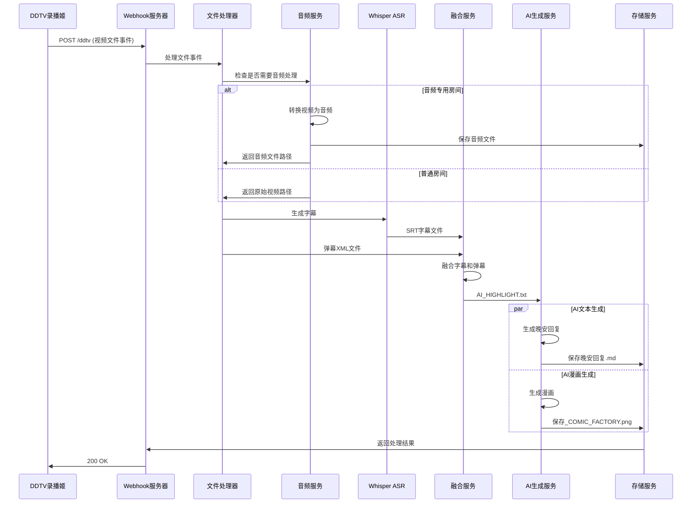
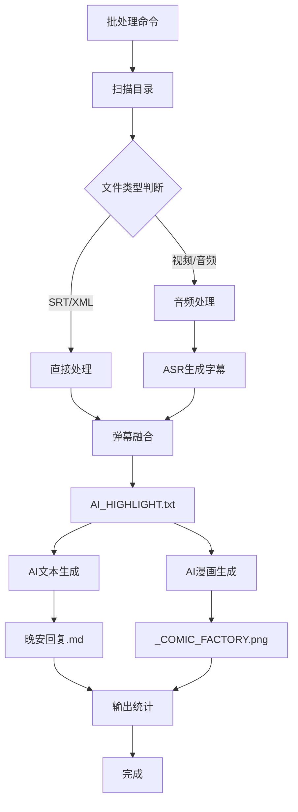

# 项目重构架构设计

## 当前问题分析

### 1. 代码重复
- 多个文件中都有`loadConfig`函数
- 配置加载逻辑分散
- 错误处理重复实现

### 2. 紧耦合
- `webhook_server.js`直接调用子进程执行其他脚本
- 缺乏接口抽象
- 模块间直接依赖

### 3. 配置管理混乱
- 配置分散在多个地方
- 没有统一的配置验证
- 环境变量和配置文件混合使用

### 4. 测试不足
- 测试覆盖率低
- 缺乏集成测试
- 测试数据管理混乱

## 新架构设计原则

### 1. 单一职责原则
每个模块只负责一个功能领域

### 2. 依赖倒置原则
高层模块不依赖低层模块，都依赖抽象

### 3. 开闭原则
对扩展开放，对修改关闭

### 4. 接口隔离原则
客户端不应该依赖它不需要的接口

## 新项目结构

```
danmaku-to-summary-ts/
├── src/
│   ├── core/                    # 核心基础设施
│   │   ├── config/             # 配置管理
│   │   │   ├── ConfigLoader.ts
│   │   │   ├── ConfigValidator.ts
│   │   │   └── ConfigInterface.ts
│   │   ├── logging/            # 日志系统
│   │   │   ├── Logger.ts
│   │   │   └── LogFormatter.ts
│   │   ├── errors/             # 错误处理
│   │   │   ├── AppError.ts
│   │   │   ├── ErrorHandler.ts
│   │   │   └── ErrorCodes.ts
│   │   └── utils/              # 通用工具
│   │       ├── FileUtils.ts
│   │       ├── ProcessUtils.ts
│   │       └── TimeUtils.ts
│   │
│   ├── services/               # 业务服务层
│   │   ├── webhook/           # Webhook服务
│   │   │   ├── WebhookServer.ts
│   │   │   ├── DDTVHandler.ts
│   │   │   ├── MikufansHandler.ts
│   │   │   └── WebhookProcessor.ts
│   │   ├── audio/             # 音频处理服务
│   │   │   ├── AudioProcessor.ts
│   │   │   ├── FFmpegService.ts
│   │   │   └── AudioConfig.ts
│   │   ├── ai/                # AI生成服务
│   │   │   ├── text/          # 文本生成
│   │   │   │   ├── TextGenerator.ts
│   │   │   │   ├── GeminiService.ts
│   │   │   │   └── PromptBuilder.ts
│   │   │   └── comic/         # 漫画生成
│   │   │       ├── ComicGenerator.ts
│   │   │       ├── PythonBridge.ts
│   │   │       └── ComicConfig.ts
│   │   ├── fusion/            # 字幕融合服务
│   │   │   ├── FusionProcessor.ts
│   │   │   ├── SrtParser.ts
│   │   │   ├── XmlParser.ts
│   │   │   └── HeatmapAnalyzer.ts
│   │   ├── pipeline/          # 流程编排服务
│   │   │   ├── PipelineOrchestrator.ts
│   │   │   ├── TaskScheduler.ts
│   │   │   └── WorkflowEngine.ts
│   │   └── storage/           # 存储服务
│   │       ├── FileStorage.ts
│   │       └── CacheManager.ts
│   │
│   ├── scripts/               # 遗留脚本（逐步迁移）
│   │   ├── legacy/           # 旧脚本备份
│   │   └── migration/        # 迁移脚本
│   │
│   ├── cli/                   # 命令行接口
│   │   ├── commands/         # 命令实现
│   │   │   ├── ProcessCommand.ts
│   │   │   ├── WebhookCommand.ts
│   │   │   └── BatchCommand.ts
│   │   └── CliApp.ts         # CLI应用入口
│   │
│   └── app/                   # 应用入口
│       ├── main.ts           # 主应用入口
│       └── bootstrap.ts      # 应用启动
│
├── config/                    # 配置文件
│   ├── default.json          # 默认配置
│   ├── development.json      # 开发环境配置
│   ├── production.json       # 生产环境配置
│   └── secrets.example.json  # 密钥配置示例
│
├── tests/                    # 测试目录
│   ├── unit/                # 单元测试
│   ├── integration/         # 集成测试
│   └── fixtures/            # 测试数据
│
├── docs/                     # 文档
│   ├── api/                 # API文档
│   ├── guides/              # 使用指南
│   └── architecture/        # 架构文档
│
└── scripts/                  # 构建和部署脚本
    ├── build.js
    ├── deploy.js
    └── migrate.js
```

## 核心模块详细设计

### 1. 配置管理系统

```typescript
// ConfigLoader.ts
interface ConfigLoader {
  load(): AppConfig;
  validate(config: AppConfig): ValidationResult;
  watch(callback: (config: AppConfig) => void): void;
}

// 配置分层
interface AppConfig {
  webhook: WebhookConfig;
  audio: AudioConfig;
  ai: AIConfig;
  fusion: FusionConfig;
  storage: StorageConfig;
  logging: LoggingConfig;
}
```

### 2. 服务接口设计

```typescript
// 服务接口
interface IAudioProcessor {
  process(videoPath: string, roomId?: string): Promise<AudioResult>;
  convertToAudio(videoPath: string, format: string): Promise<string>;
}

interface ITextGenerator {
  generate(highlightPath: string, roomId?: string): Promise<TextResult>;
  batchGenerate(directory: string): Promise<BatchResult[]>;
}

interface IComicGenerator {
  generate(highlightPath: string, roomId?: string): Promise<ComicResult>;
}

interface IFusionProcessor {
  process(inputs: FusionInput[]): Promise<FusionResult>;
}
```

### 3. 依赖注入容器

```typescript
// 依赖注入容器
class Container {
  private services: Map<string, any> = new Map();
  
  register<T>(name: string, service: T): void;
  resolve<T>(name: string): T;
  createScope(): Container;
}

// 服务工厂
class ServiceFactory {
  static createAudioProcessor(config: AudioConfig): IAudioProcessor;
  static createTextGenerator(config: AIConfig): ITextGenerator;
  static createWebhookServer(config: WebhookConfig): WebhookServer;
}
```

### 4. 事件驱动架构

```typescript
// 事件总线
class EventBus {
  subscribe(event: string, handler: EventHandler): void;
  publish(event: string, data: any): void;
}

// 事件定义
interface FileProcessedEvent {
  type: 'file.processed';
  payload: {
    filePath: string;
    roomId: string;
    result: ProcessResult;
  };
}

interface AIGenerationCompletedEvent {
  type: 'ai.generation.completed';
  payload: {
    highlightPath: string;
    outputPath: string;
    type: 'text' | 'comic';
  };
}
```

## 数据流设计

### 1. Webhook处理流程



### 2. 批处理流程



## 迁移策略

### 阶段1：基础设施重构
1. 创建核心模块（配置、日志、错误处理）
2. 实现依赖注入容器
3. 创建测试框架

### 阶段2：服务层重构
1. 将现有脚本重构为服务类
2. 定义清晰的接口
3. 实现服务工厂

### 阶段3：Webhook服务器重构
1. 重构webhook_server.js为TypeScript
2. 实现事件驱动架构
3. 添加中间件支持

### 阶段4：CLI工具重构
1. 创建统一的CLI框架
2. 迁移现有命令
3. 添加新命令

### 阶段5：测试和文档
1. 编写单元测试
2. 编写集成测试
3. 更新文档

## 技术选型

### 运行时
- Node.js 18+
- TypeScript 5.0+

### 核心库
- `inversify` - 依赖注入容器
- `winston` - 日志系统
- `joi` - 配置验证
- `commander` - CLI框架
- `jest` - 测试框架

### 保持兼容性
- 保持现有的配置文件格式
- 提供迁移脚本
- 逐步替换，不一次性重写

## 性能考虑

### 1. 并发处理
- 使用工作池处理多个文件
- 限制同时处理的文件数量
- 实现队列系统

### 2. 内存管理
- 流式处理大文件
- 及时释放资源
- 监控内存使用

### 3. 缓存策略
- 缓存配置加载
- 缓存API调用结果
- 实现LRU缓存

## 监控和运维

### 1. 健康检查
- 添加健康检查端点
- 服务状态监控
- 资源使用监控

### 2. 日志系统
- 结构化日志
- 日志级别控制
- 日志轮转

### 3. 指标收集
- 处理时间指标
- 错误率指标
- 资源使用指标

## 下一步行动

1. 创建项目脚手架
2. 实现核心基础设施
3. 逐步迁移现有功能
4. 编写测试用例
5. 更新文档

这个架构设计将解决当前项目的主要问题，同时保持向后兼容性，确保平稳迁移。